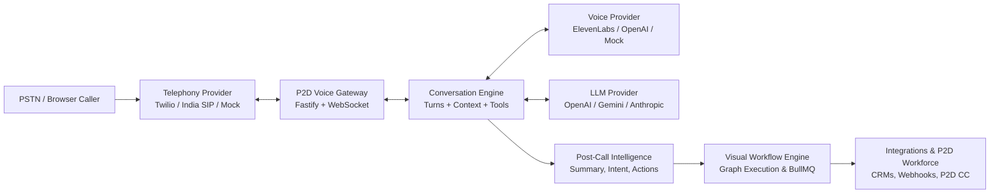

# P2D Voice AI Agent Platform

> Enterprise Multi-Agent Voice AI Platform & Voice Execution Interface for the Pur2Divin (P2D) Agent Workforce.

[](https://github.com/jogdandsainath/p2d-voice-ai-agent/actions)
[](LICENSE)
[](https://www.typescriptlang.org/)
[](https://fastify.io/)
[](https://nextjs.org/)

---

## 1. Overview

**P2D Voice AI Agent** is a production-grade, telephony-agnostic, multi-agent Voice AI platform designed to transform real-time spoken conversations into structured intelligence, business decisions, and automated downstream workflows.

Rather than being a simple phone bot or IVR wrapper, P2D Voice AI Agent enables organizations to:
- **Build and manage multiple specialized Voice Agents** (Sales SDR, Customer Support, Recruitment, Admissions, Collections).
- **Decouple Telephony & Voice providers** via clean provider ports (Twilio, ElevenLabs, OpenAI, India PSTN/SIP / Exotel, Web Simulator).
- **Run Real-Time Inbound and Outbound Conversations** with interruptibility (barge-in) and real-time tool calling.
- **Extract Deep Post-Call Intelligence:** Summaries, intents, entities, sentiment, objections, commitments, and structured action items.
- **Execute Automated Post-Call Workflows:** Visual React Flow graph automation (CRM updates, webhook dispatching, email notifications, calendar bookings).
- **Emit Standardized Events to the P2D Command Center:** Seamless integration with P2D Outreach, Leads Directory, and the P2D Agent Workforce.

---

## 2. Core Architecture Topology



---

## 3. Monorepo Structure

```text
p2d-voice-ai-agent/
├── apps/
│   ├── api/          # High-throughput Fastify REST API & WebSocket Voice Gateway
│   ├── web/          # Next.js Enterprise Web UI (Dashboard, Agent Builder, Workflows, Call Center)
│   └── worker/       # Asynchronous Worker for intelligence processing & workflow execution
│
├── packages/
│   ├── shared/       # Canonical TypeScript models, DTOs, Enums, Event schemas, Errors
│   ├── database/     # Multi-tenant PostgreSQL schema (Prisma ORM), migrations, seeders
│   ├── telephony/    # TelephonyProvider interface + Twilio, India SIP, and Simulator adapters
│   ├── voice/        # VoiceProvider interface + ElevenLabs, OpenAI, and Simulator adapters
│   ├── ai/           # LLM provider interface + Conversation Engine + Intelligence Analyzer
│   ├── workflows/    # Visual node-based workflow graph compiler and async execution engine
│   ├── integrations/ # Generic REST/Webhook connector framework + P2D event dispatcher
│   └── auth/         # JWT authentication, RBAC policy checker, AES-256-GCM secret vault
│
├── docs/             # PRD, Architecture, User Stories, Engineering Stories, ADRs (001-009)
├── tests/            # Unit, integration, workflow, and simulation test suite
└── infrastructure/   # Docker Compose and CI/CD workflows
```

---

## 4. Getting Started

### 4.1 Prerequisites
- Node.js `v20.x` or higher
- npm / pnpm
- (Optional) PostgreSQL & Redis for production mode (simulator runs with in-memory stores)

### 4.2 Installation & Setup
```bash
# Clone repository
git clone https://github.com/jogdandsainath/p2d-voice-ai-agent.git
cd p2d-voice-ai-agent

# Configure environment variables
cp .env.example .env

# Install dependencies
npm install

# Initialize database schema & seed initial demo data
npm run db:generate
npm run db:seed
```

### 4.3 Running Development Services
```bash
# Start API server, Background Worker, and Next.js Web UI concurrently
npm run dev
```

The services will be available at:
- **Web UI:** [http://localhost:3000](http://localhost:3000)
- **API Server:** [http://localhost:4000](http://localhost:4000)
- **API Swagger / Docs:** [http://localhost:4000/docs](http://localhost:4000/docs)
- **Health Check:** [http://localhost:4000/health](http://localhost:4000/health)

---

## 5. End-to-End Demo Flows

### Demo 1: P2D Inbound Sales Qualification Agent
1. Customer calls inbound phone number `+14155552671` (or initiates browser call in Agent Simulator).
2. AI answers: *"Hello, thank you for calling Pur2Divin. How can I help you today?"*
3. Customer provides name, company, and requests a product demo.
4. Call completes → Audio recorded & transcript generated with diarization.
5. AI Post-Call Intelligence extracts:
   - Intent: `demo_request`
   - Outcome: `qualified_lead`
   - Actions: `Schedule 30-min demo`
   - Summary & Next Best Action
6. Post-Call Workflow triggers:
   - Evaluates condition: `intent == "demo_request"`
   - Creates CRM Lead record
   - Dispatches authenticated webhook to P2D Command Center.

### Demo 2: Outbound Lead Follow-up Agent
1. System triggers `POST /api/v1/calls/outbound` with customer metadata.
2. AI dials customer → Explains purpose → Analyzes customer response.
3. Classifies outcome (`Interested`, `Callback`, `Not Interested`) → Triggers corresponding workflow branch.

---

## 6. Running Tests
```bash
# Run unit and integration tests
npm run test

# Run tests with coverage
npm run test:coverage
```

---

## 7. Documentation Index
- [Product Requirements Document (PRD)](./docs/PRD.md)
- [System Architecture Specification](./docs/ARCHITECTURE.md)
- [User Stories (US-001 - US-073)](./docs/USER_STORIES.md)
- [Engineering Stories](./docs/ENGINEERING_STORIES.md)
- [API Specification](./docs/API.md)
- [Database Schema & Data Architecture](./docs/DATABASE.md)
- [Security & Compliance](./docs/SECURITY.md)
- [Telephony Architecture & India Telecom Compliance](./docs/TELEPHONY.md)
- [Voice & Audio AI Architecture](./docs/VOICE_PROVIDER.md)
- [Workflow Engine Design](./docs/WORKFLOWS.md)
- [Integrations & P2D Workforce Event Bus](./docs/INTEGRATIONS.md)
- [Production Deployment Guide](./docs/DEPLOYMENT.md)
- [Local Development Guide](./docs/LOCAL_DEVELOPMENT.md)
- [Architecture Decision Records (ADRs 001-009)](./docs/adr/)

---

## 8. License
Copyright © 2026 Pur2Divin (P2D). All rights reserved. Licensed under the MIT License.
