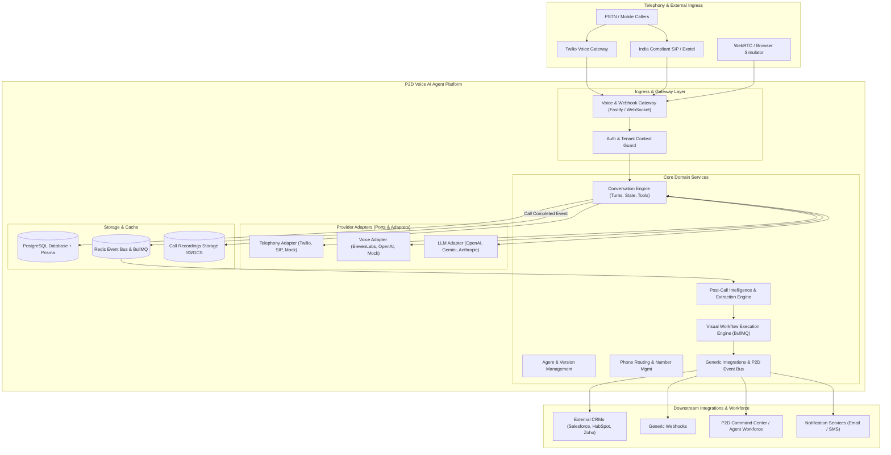
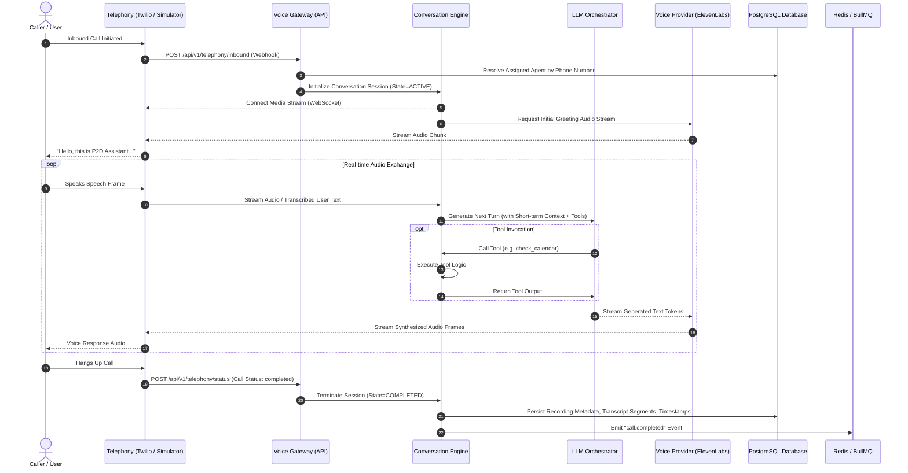
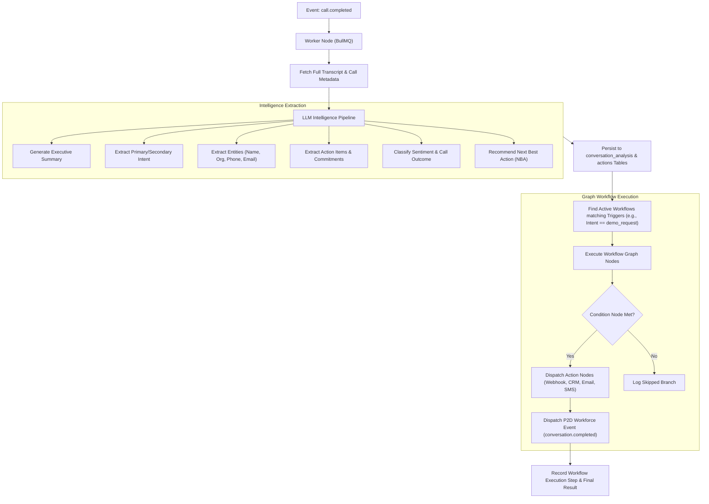

# Architecture Specification

## Project: P2D Voice AI Agent Platform
**Document Version:** 1.0.0  
**Status:** Canonical System Design  

---

## 1. System Overview & Architectural Topology

The P2D Voice AI Agent Platform is designed following **Clean Architecture**, **Domain-Driven Design (DDD)**, and **Hexagonal Provider Abstractions** (Ports & Adapters).



---

## 2. Layered Architecture & Monorepo Package Topology

```text
p2d-voice-ai-agent/
├── apps/
│   ├── api/          # Fastify / Node.js High-throughput REST API & WebSocket Voice Gateway
│   ├── web/          # Next.js 14 / React 18 / Tailwind / Radix / React Flow Web Application
│   └── worker/       # BullMQ Asynchronous Processing Worker (Intelligence & Workflows)
│
├── packages/
│   ├── shared/       # Canonical TypeScript interfaces, Enums, DTOs, Event schemas, Errors
│   ├── database/     # Multi-tenant PostgreSQL schema (Prisma ORM), seeders, client
│   ├── telephony/    # TelephonyProvider interface + Twilio, India SIP, and Simulator adapters
│   ├── voice/        # VoiceProvider interface + ElevenLabs, OpenAI Audio, and Simulator adapters
│   ├── ai/           # LLM provider interface + Conversation Engine + Structured Intelligence analyzer
│   ├── workflows/    # Visual node-based workflow graph compiler and async execution engine
│   ├── integrations/ # Generic REST/Webhook connector framework + P2D workforce event dispatcher
│   └── auth/         # JWT token management, RBAC enforcement, AES-256-GCM secret vault
│
├── docs/             # Architecture, PRD, User Stories, Engineering Stories, ADRs
├── tests/            # End-to-end integration and simulation test suite
└── infrastructure/   # Docker Compose, Kubernetes manifests, CI/CD pipelines
```

---

## 3. Real-Time Conversation Engine Flow



---

## 4. Post-Call Intelligence & Workflow Execution Pipeline



---

## 5. Security & Isolation Architecture

1. **Multi-Tenant Scoping:** Every database entity is indexed and scoped with `organization_id`. Database queries strictly validate the calling actor's tenant boundary.
2. **Role-Based Access Control (RBAC):**
   - `Owner`: Organization administrator with billing and user deletion permissions.
   - `Admin`: Full control over agents, phone numbers, workflows, integrations, and users.
   - `Builder`: Creation and editing of agents, voices, prompts, knowledge bases, and workflows.
   - `Operator`: Live call monitoring, manual call dispatch, human handoff, and conversation review.
   - `Analyst`: Read-only access to conversation transcripts, analytics dashboards, and intelligence summaries.
   - `Viewer`: Read-only access to published agents and basic reports.
3. **Secret Storage:** All integration credentials, provider API keys (ElevenLabs, Twilio, OpenAI, CRMs) are encrypted using AES-256-GCM with unique initialization vectors (IV) before persistence.
4. **Webhook Integrity:** Inbound telephony webhooks validate HMAC SHA-256 cryptographic signatures. Outbound webhooks send signed payloads via `X-P2D-Signature`.
