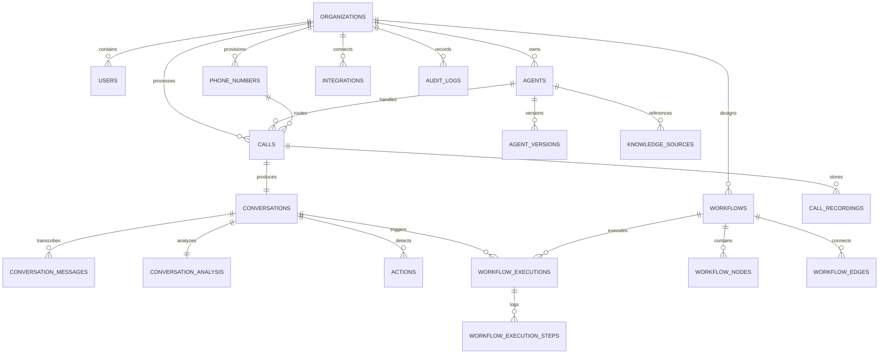

# Database Schema & Data Architecture

## Project: P2D Voice AI Agent Platform
**Database Engine:** PostgreSQL 15+  
**ORM / Data Layer:** Prisma ORM  

---

## 1. Entity-Relationship Diagram (ERD)

---

## 2. Table Specifications

### 2.1 Core Multi-Tenancy & Identity
- **`organizations`**: `id` (PK, UUID), `name`, `slug`, `created_at`, `updated_at`
- **`users`**: `id` (PK, UUID), `organization_id` (FK), `email`, `password_hash`, `name`, `role` (`Owner` | `Admin` | `Builder` | `Operator` | `Analyst` | `Viewer`), `created_at`, `updated_at`
- **`audit_logs`**: `id` (PK, UUID), `organization_id` (FK), `user_id` (FK, nullable), `action`, `resource_type`, `resource_id`, `details` (JSONB), `ip_address`, `created_at`

### 2.2 Agents & Knowledge
- **`agents`**: `id` (PK, UUID), `organization_id` (FK), `name`, `description`, `avatar_url`, `status` (`Draft` | `Published` | `Paused` | `Archived`), `published_version_id` (UUID, nullable), `created_at`, `updated_at`
- **`agent_versions`**: `id` (PK, UUID), `agent_id` (FK), `version_number` (string, e.g. "1.0.0"), `system_prompt`, `personality`, `voice_provider` (string), `voice_id` (string), `voice_settings` (JSONB), `language` (string), `model_provider` (string), `model_name` (string), `temperature` (float), `tools` (JSONB), `guardrails` (JSONB), `created_by` (FK), `created_at`
- **`knowledge_sources`**: `id` (PK, UUID), `agent_id` (FK), `type` (`document` | `url` | `text_snippet`), `title`, `content_text`, `source_url`, `status`, `created_at`

### 2.3 Telephony & Phone Numbers
- **`phone_numbers`**: `id` (PK, UUID), `organization_id` (FK), `phone_number` (E.164 string, unique), `provider` (`twilio` | `india_sip` | `exotel` | `mock`), `assigned_agent_id` (FK, nullable), `friendly_name`, `recording_enabled` (boolean), `consent_announcement` (boolean), `business_hours` (JSONB), `fallback_number` (string, nullable), `created_at`, `updated_at`

### 2.4 Calls & Recordings
- **`calls`**: `id` (PK, UUID), `organization_id` (FK), `agent_id` (FK), `phone_number_id` (FK, nullable), `provider_call_sid` (string, indexed), `direction` (`inbound` | `outbound`), `caller_number` (string), `destination_number` (string), `status` (`initiated` | `ringing` | `in_progress` | `completed` | `failed` | `busy` | `no_answer`), `started_at`, `answered_at`, `ended_at`, `duration_seconds` (integer), `created_at`, `updated_at`
- **`call_recordings`**: `id` (PK, UUID), `call_id` (FK, unique), `provider_recording_sid` (string), `recording_url` (string), `duration_seconds` (integer), `status` (`processing` | `completed` | `deleted`), `retention_expires_at` (timestamp), `created_at`

### 2.5 Conversations & Intelligence
- **`conversations`**: `id` (PK, UUID), `organization_id` (FK), `call_id` (FK, unique), `agent_id` (FK), `session_state` (`CREATED` | `CONNECTING` | `ACTIVE` | `ON_HOLD` | `TRANSFERRING` | `COMPLETED` | `FAILED`), `created_at`, `updated_at`
- **`conversation_messages`**: `id` (PK, UUID), `conversation_id` (FK), `speaker` (`agent` | `customer` | `system`), `text` (text), `start_time` (float), `end_time` (float), `confidence` (float), `tool_calls` (JSONB, nullable), `created_at`
- **`conversation_analysis`**: `id` (PK, UUID), `conversation_id` (FK, unique), `summary` (text), `intent` (string), `outcome` (string), `sentiment` (string), `priority` (`low` | `medium` | `high` | `urgent`), `customer_name` (string, nullable), `organization` (string, nullable), `phone` (string, nullable), `email` (string, nullable), `topics` (JSONB), `objections` (JSONB), `commitments` (JSONB), `next_best_action` (text), `created_at`
- **`actions`**: `id` (PK, UUID), `conversation_id` (FK), `organization_id` (FK), `action_type` (string), `description` (text), `owner` (string), `priority` (string), `due_date` (timestamp, nullable), `status` (`Detected` | `Pending` | `Running` | `Completed` | `Failed` | `Cancelled`), `confidence` (float), `execution_result` (JSONB, nullable), `created_at`, `updated_at`

### 2.6 Workflows & Automations
- **`workflows`**: `id` (PK, UUID), `organization_id` (FK), `name`, `description`, `trigger_type` (`Call Completed` | `Intent Detected` | `Action Detected` | `Manual`), `is_active` (boolean), `created_at`, `updated_at`
- **`workflow_nodes`**: `id` (PK, UUID), `workflow_id` (FK), `node_key` (string), `type` (`Trigger` | `Condition` | `AI Analysis` | `Webhook` | `Email` | `SMS` | `CRM` | `Wait`), `config` (JSONB), `position_x` (float), `position_y` (float)
- **`workflow_edges`**: `id` (PK, UUID), `workflow_id` (FK), `source_node_id` (FK), `target_node_id` (FK), `condition_value` (string, nullable)
- **`workflow_executions`**: `id` (PK, UUID), `workflow_id` (FK), `organization_id` (FK), `conversation_id` (FK), `status` (`RUNNING` | `COMPLETED` | `FAILED`), `trigger_payload` (JSONB), `started_at`, `completed_at`, `error_message` (text, nullable)
- **`workflow_execution_steps`**: `id` (PK, UUID), `execution_id` (FK), `node_id` (FK), `status` (`PENDING` | `RUNNING` | `COMPLETED` | `FAILED` | `SKIPPED`), `input_data` (JSONB), `output_data` (JSONB), `duration_ms` (integer), `created_at`

### 2.7 Integrations
- **`integrations`**: `id` (PK, UUID), `organization_id` (FK), `provider` (`webhook` | `salesforce` | `hubspot` | `zoho` | `slack` | `p2d_cc`), `name`, `base_url` (string), `auth_type` (`none` | `api_key` | `bearer` | `basic` | `oauth2`), `is_active` (boolean), `created_at`, `updated_at`
- **`integration_credentials`**: `id` (PK, UUID), `integration_id` (FK, unique), `encrypted_credentials` (text), `iv` (string), `auth_tag` (string), `created_at`, `updated_at`

---

## 3. Indexing & Multi-Tenant Partitioning Strategy
- Composite indexes on `(organization_id, created_at DESC)` for all time-series and listing tables.
- Unique constraints on `(organization_id, phone_number)` and `(provider_call_sid)`.
- Foreign key constraints with `ON DELETE CASCADE` where child entities (e.g. messages, recordings) belong exclusively to parent calls/conversations.
